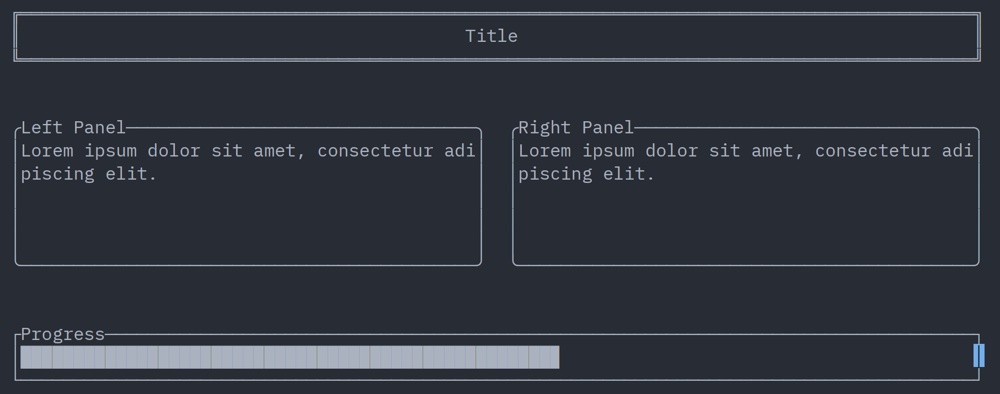

# CGI : Console Graphic Interfaces

CGI is a lightweight library for rendering simple interfaces in the terminal. It provides basic drawing capabilities, allowing you to create text-based UIs with ease.

## Warning : work in progress

The project is far from finished. Some breaking changes WILL be made in the future. 

For more informations on what features are missing, see [missing features](#features-yet-to-be-implemented)

## Features 

- Fast and efficient rendering.
- Dynamic resizing on terminal size changes.
- Windows and panels for organizing content with borders and titles.
- Layout management to provide several layouts based on the terminal size.

## Features yet to be implemented

- Major: Dynamic changes to the content (right now only static content is supported)
- Diverse text rendering capabilities, including support for colors and styles.
- Event handling for user input.
- Windows and Mac support (should be easy)

## Example and screenshots

The following example demonstrates a simple application with a title, two panels, and a progress bar.



The code for this example is quite simple and straightforward.

```rust
let mut app = cgi::Application::new();

    let title = WidgetBuilder::new(TextBox::new(
        "Title",
        Listener::empty(),
        TextAlign::Center,
    ))
    .with_outline(OutlineStyle::Double)
    .build();

    let panel_left = WidgetBuilder::new(TextBox::new(
        "Lorem ipsum dolor sit amet, consectetur adipiscing elit.",
        Listener::empty(),
        TextAlign::Left,
    ))
    .with_outline(OutlineStyle::Rounded)
    .with_title("Left Panel")
    .build();
    let panel_right = WidgetBuilder::new(TextBox::new(
        "Lorem ipsum dolor sit amet, consectetur adipiscing elit.",
        Listener::empty(),
        TextAlign::Left,
    ))
    .with_outline(OutlineStyle::Rounded)
    .with_title("Right Panel")
    .build();

    let progress_bar = WidgetBuilder::new(ProgressBar::new(
        ProgressBarType::HorizontalNineLevels,
        0.565, // 56.5% fill level
        Listener::empty(),
    ))
    .with_outline(OutlineStyle::Normal)
    .with_title("Progress")
    .build();

    // Title takes 30% of screen height at the top
    let title_placement = WidgetPlacement::fullscreen().with_height(0.3);
    let mut panels_below_placement = [WidgetPlacement::fullscreen(); 2];

    // Position panels 30% down from top, set their height to 70% minus 3 lines, then split into 2 columns
    title_placement
        .shift(0.0, 0.3)
        .with_height(Hybrid(-3, 0.7))
        .split(2, 1, &mut panels_below_placement);
    // Position progress bar at bottom with Hybrid: 3 lines from bottom (absolute), 100% width
    let progress_bar_placement =
        WidgetPlacement::new(Absolute(0), Hybrid(-3, 1.0), 1.0.into(), 1.0.into());

    let mut layout = cgi::Layout::new()
        .with_widget(&title, title_placement.expand_or_shrink(-1, -1))
        .with_widget(
            &panel_left,
            panels_below_placement[0].expand_or_shrink(-1, -1),
        )
        .with_widget(
            &panel_right,
            panels_below_placement[1].expand_or_shrink(-1, -1),
        )
        .with_widget(
            &progress_bar,
            progress_bar_placement.expand_or_shrink(-1, 0),
        );

    // Set layout selection: always use "MainLayout" regardless of terminal size
    app.set_layout_behaviour(|(..)| "MainLayout".to_string());
    app.add_layout("MainLayout", layout);

    app.run();
```